# ZODO CRM — System Design, Data Flow & Workflow

## 1. High-Level Architecture

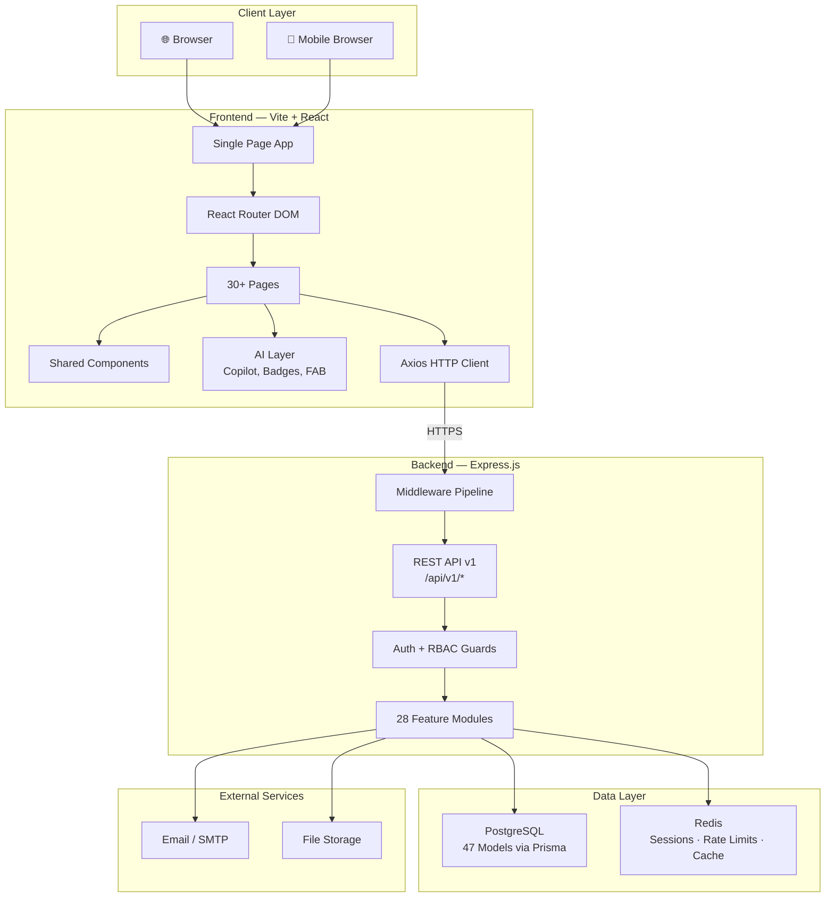

---

## 2. Backend Architecture

### 2.1 Middleware Pipeline (Request Lifecycle)

Every HTTP request passes through this ordered pipeline:

```mermaid
graph LR
    REQ["Incoming Request"] --> Helmet["🛡 Helmet<br/>Security Headers"]
    Helmet --> CORS["🔗 CORS<br/>Origin Validation"]
    CORS --> Parse["📦 Body Parser<br/>JSON · URL-encoded"]
    Parse --> Compress["📐 Compression<br/>gzip"]
    Compress --> ReqID["🏷 Request ID<br/>UUID Tracking"]
    ReqID --> Timer["⏱ Request Timing"]
    Timer --> Logger["📝 Request Logger"]
    Logger --> RateLimit["🚦 Rate Limiter"]
    RateLimit --> Route["🛣 Route Handler"]
    Route --> Error["❗ Error Handler"]
    Error --> RES["Response"]

    style Helmet fill:#1e293b,stroke:#22d3ee,color:#fff
    style CORS fill:#1e293b,stroke:#22d3ee,color:#fff
    style RateLimit fill:#1e293b,stroke:#f97316,color:#fff
    style Route fill:#0891b2,stroke:#22d3ee,color:#fff
```

### 2.2 Module Architecture (Layered Pattern)

Each of the 28 modules follows a consistent 5-layer pattern:

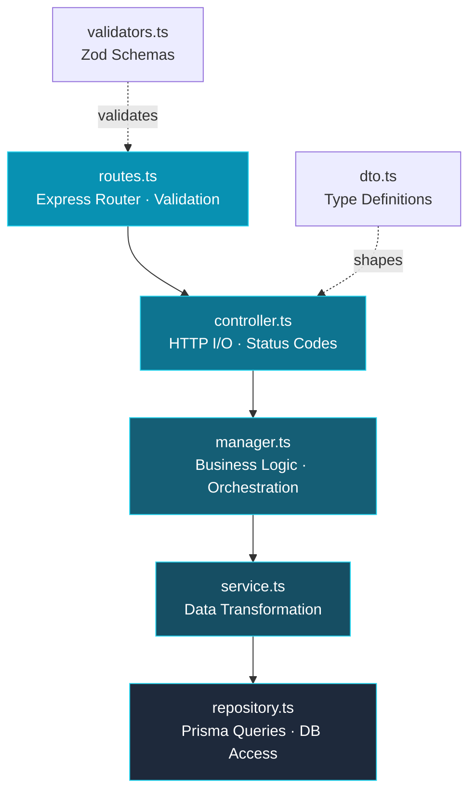

### 2.3 All 28 Backend Modules

| Domain | Modules |
|--------|---------|
| **Core** | `auth` |
| **CRM** | `leads`, `lead-sources`, `clients`, `contacts`, `groups` |
| **Users & Access** | `users`, `employees`, `roles`, `permissions`, `tenants` |
| **Operations** | `tasks`, `projects`, `calendar` |
| **Finance** | `invoices`, `expenses`, `bookings` |
| **Files** | `files`, `folders` |
| **Communication** | `emails`, `chat` |
| **Applications** | `applications` |
| **E-commerce** | `ecommerce` |
| **System** | `settings`, `analytics`, `notifications`, `tags`, `audit` |

---

## 3. Authentication & Authorization Flow

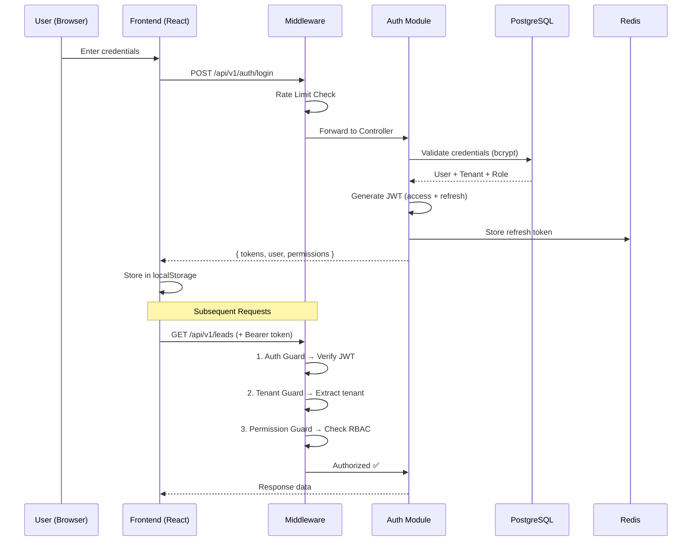

### Guard Chain (per request)

```
Request → Auth Guard → Tenant Guard → Permission Guard → Route Handler
           │               │                │
           ▼               ▼                ▼
        Verify JWT    Extract tenant    Check role has
        from header   from token        required permission
```

---

## 4. Data Model (Entity Relationship)

### 4.1 Core Entity Relationships

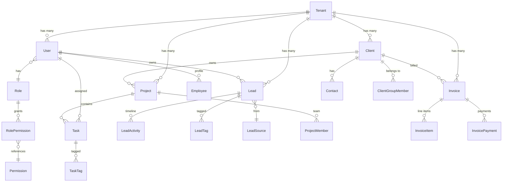

### 4.2 All 47 Database Models

| Category | Models |
|----------|--------|
| **Multi-Tenancy** | `Tenant`, `TenantSettings` |
| **Identity** | `User`, `RefreshToken`, `Employee`, `UserPreferences` |
| **Access Control** | `Role`, `Permission`, `RolePermission` |
| **CRM** | `Lead`, `LeadSource`, `LeadTag`, `LeadActivity`, `Client`, `Contact`, `ClientGroup`, `ClientGroupMember`, `Application` |
| **Operations** | `Task`, `TaskTag`, `Project`, `ProjectMember`, `CalendarEvent`, `CalendarEventAttendee` |
| **Finance** | `Invoice`, `InvoiceItem`, `InvoicePayment`, `Expense`, `ExpenseBudget`, `Booking` |
| **Files** | `Folder`, `File`, `FileTag` |
| **E-commerce** | `ProductCategory`, `Product`, `Order`, `OrderItem` |
| **Communication** | `Email`, `EmailLabel`, `EmailLabelAssignment`, `EmailAttachment`, `ChatRoom`, `ChatParticipant`, `ChatMessage` |
| **System** | `Notification`, `AuditLog`, `Tag` |

---

## 5. Frontend Architecture

### 5.1 Component Hierarchy

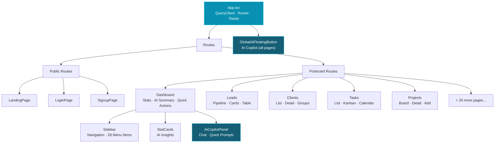

### 5.2 AI Layer Architecture

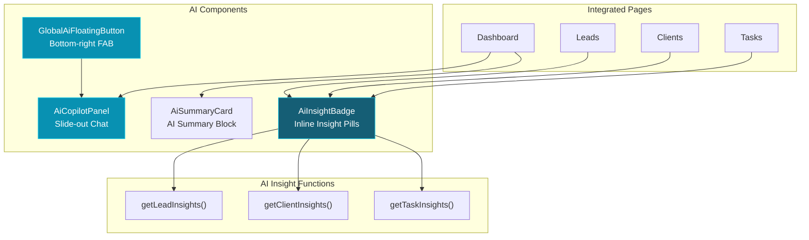

---

## 6. Key Workflows

### 6.1 Lead-to-Client Conversion

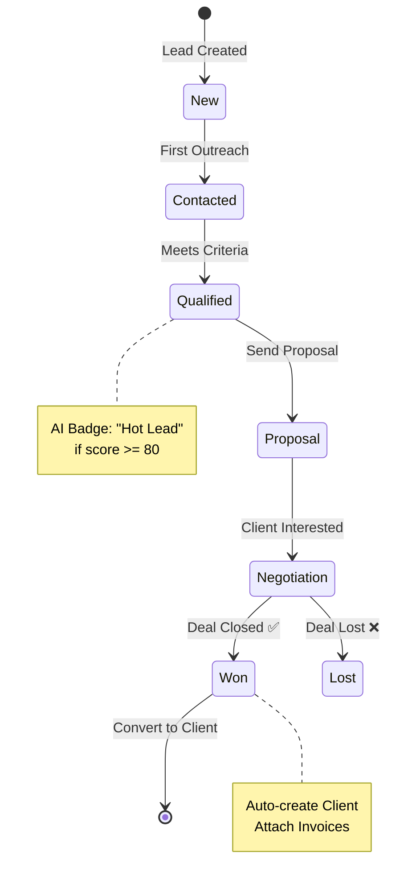

### 6.2 Task Lifecycle

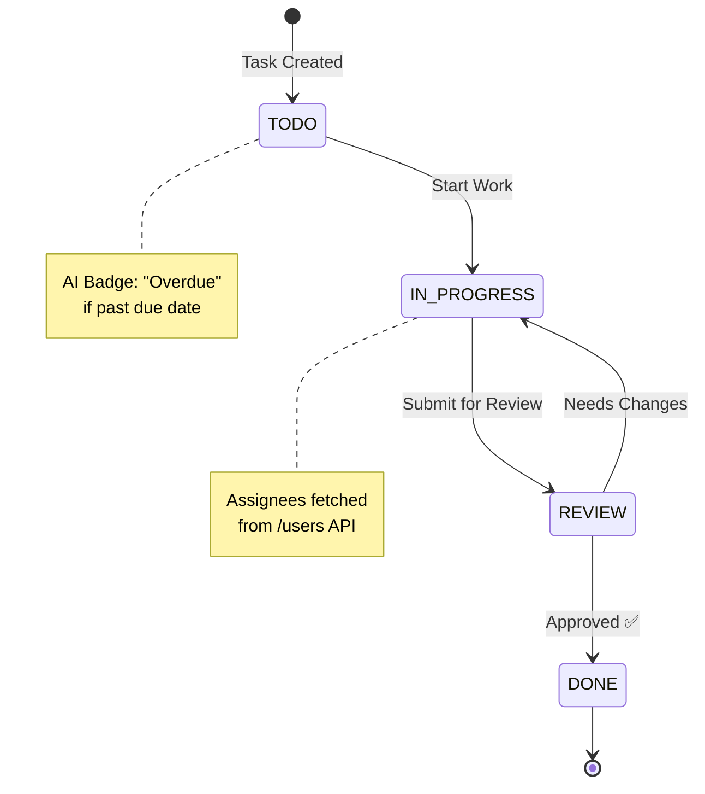

### 6.3 Invoice Workflow

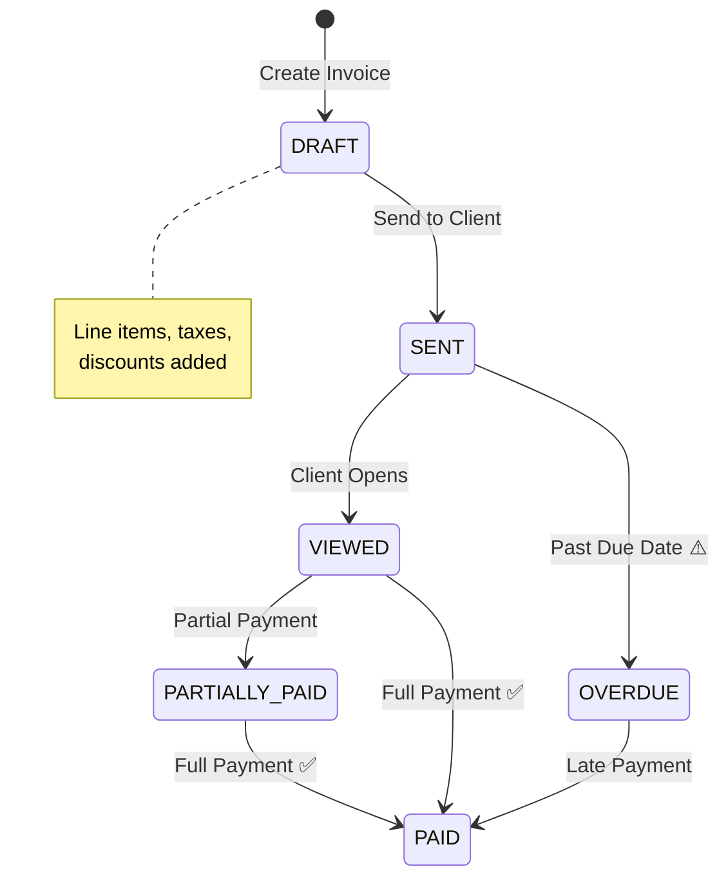

### 6.4 Project Workflow

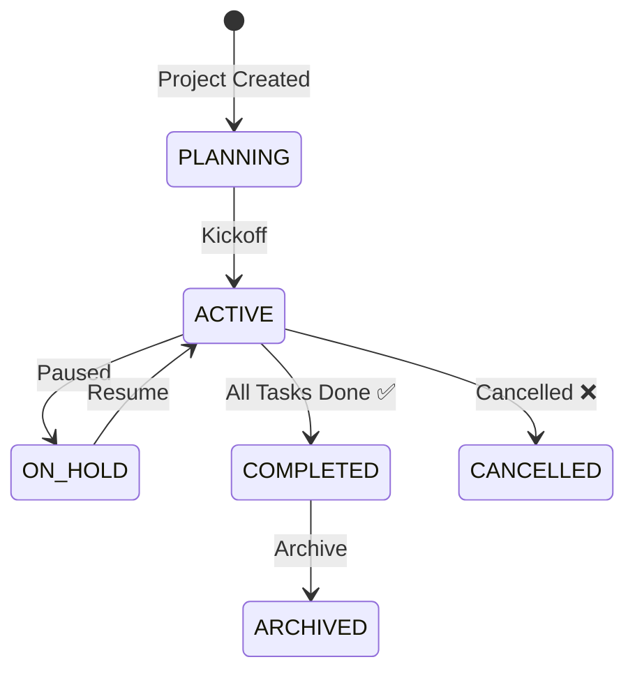

---

## 7. Data Flow Diagram

### 7.1 Request/Response Flow

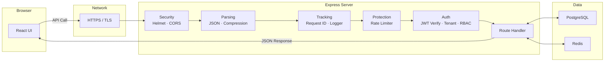

### 7.2 Multi-Tenant Data Isolation

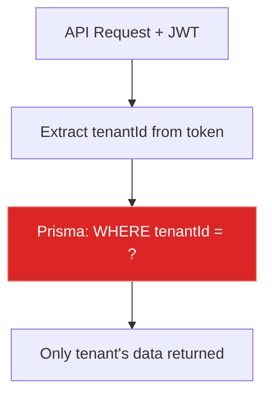

Every database query is automatically scoped to the authenticated user's tenant, ensuring complete data isolation between organizations.

---

## 8. Deployment Architecture

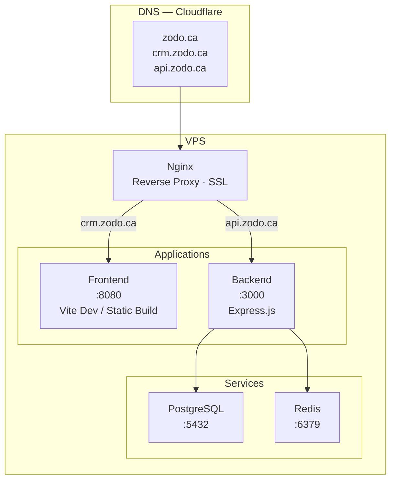

---

## 9. Tech Stack Summary

| Layer | Technology |
|-------|-----------|
| **Frontend** | Vite, React 18, TypeScript, TailwindCSS, shadcn/ui, Framer Motion |
| **State Management** | React Query (TanStack), React Hooks |
| **HTTP Client** | Axios (with interceptors for auth) |
| **Backend** | Node.js, Express.js, TypeScript |
| **ORM** | Prisma (type-safe queries, migrations) |
| **Database** | PostgreSQL |
| **Caching** | Redis |
| **Authentication** | JWT (access + refresh tokens), bcrypt |
| **Authorization** | RBAC (Role-Based Access Control) with permission guards |
| **Multi-Tenancy** | Tenant ID in JWT, row-level data isolation |
| **Validation** | Zod (backend), HTML5 + React state (frontend) |
| **Security** | Helmet, CORS, Rate Limiting, Request ID tracking |
| **API Docs** | Swagger / OpenAPI (dev only) |
| **Deployment** | VPS, Nginx, SSL via Let's Encrypt |
| **AI Layer** | Client-side heuristics (future: LLM integration) |
