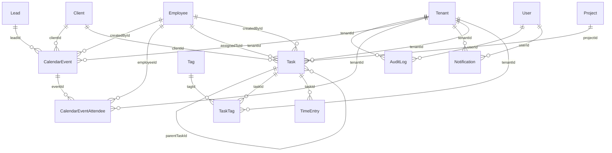
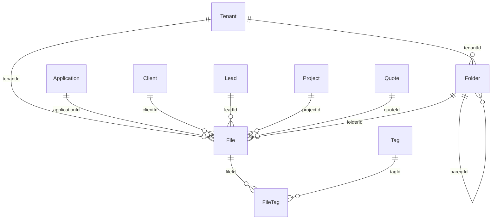
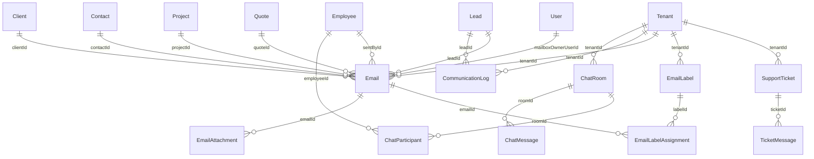
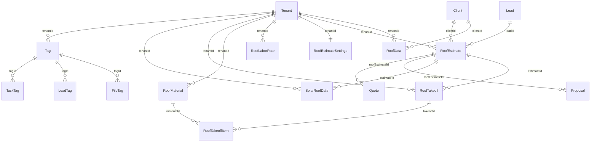

# Current CRM ER Diagram Only

This document contains only entity relationships and connection maps from the current database schema.

## Global Backbone

```mermaid
erDiagram
  ChatRoom ||--o{ ChatMessage : "roomId"
  ChatRoom ||--o{ ChatParticipant : "roomId"
  Client ||--o{ Booking : "clientId"
  Client ||--o{ CalendarEvent : "clientId"
  Client ||--o{ ClientGroupMember : "clientId"
  Client ||--o{ Contact : "companyId"
  Client ||--o{ Contract : "clientId"
  Client ||--o{ Email : "clientId"
  Client ||--o{ File : "clientId"
  Client ||--o{ Invoice : "clientId"
  Client ||--o{ InvoicePayment : "clientId"
  Client ||--o{ Order : "clientId"
  Client ||--o{ Project : "clientId"
  Client ||--o{ Quote : "clientId"
  Client ||--o{ RoofData : "clientId"
  Client ||--o{ RoofEstimate : "clientId"
  Client ||--o{ Task : "clientId"
  Client ||--o{ UserAccess : "clientId"
  Contact ||--o{ Email : "contactId"
  Email ||--o{ EmailAttachment : "emailId"
  Email ||--o{ EmailLabelAssignment : "emailId"
  Employee ||--o{ Availability : "employeeId"
  Employee ||--o{ Booking : "assignedToId"
  Employee ||--o{ CalendarEvent : "createdById"
  Employee ||--o{ CalendarEventAttendee : "employeeId"
  Employee ||--o{ ChatParticipant : "employeeId"
  Employee ||--o{ ChecklistSubmission : "employeeId"
  Employee ||--o{ Client : "assignedOwnerId"
  Employee ||--o{ Contract : "createdById"
  Employee ||--o{ CrewNotification : "employeeId"
  Employee ||--o{ Email : "sentById"
  Employee ||--o{ EmployeeDocument : "employeeId"
  Employee ||--o{ Equipment : "assignedToId"
  Employee ||--o{ Expense : "approvedById"
  Employee ||--o{ Expense : "createdById"
  Employee ||--o{ IncidentReport : "reportedById"
  Employee ||--o{ Invoice : "createdById"
  Employee ||--o{ JobCompletion : "completedById"
  Employee ||--o{ JobMessage : "senderId"
  Employee ||--o{ JobNote : "employeeId"
  Employee ||--o{ JobPhoto : "employeeId"
  Employee ||--o{ Lead : "assignedToId"
  Employee ||--o{ Lead : "createdById"
  Employee ||--o{ LeaveRequest : "employeeId"
  Employee ||--o{ LeaveRequest : "reviewedById"
  Employee ||--o{ LocationPing : "employeeId"
  Employee ||--o{ MaterialRequest : "requestedById"
  Employee ||--o{ ProjectMember : "employeeId"
  Employee ||--o{ Proposal : "createdById"
  Employee ||--o{ Quote : "createdById"
  Employee ||--o{ Task : "assignedToId"
  Employee ||--o{ Task : "createdById"
  Employee ||--o{ TimeEntry : "employeeId"
  Employee ||--o{ UserAccess : "employeeId"
  Invoice ||--o{ InvoiceItem : "invoiceId"
  Invoice ||--o{ InvoicePayment : "invoiceId"
  Lead ||--o{ CalendarEvent : "leadId"
  Lead ||--o{ CommunicationLog : "leadId"
  Lead ||--o{ Email : "leadId"
  Lead ||--o{ File : "leadId"
  Lead ||--o{ LeadActivity : "leadId"
  Lead ||--|| LeadContactedDetails : "leadId"
  Lead ||--o{ LeadInspection : "leadId"
  Lead ||--o{ LeadInsuranceClaim : "leadId"
  Lead ||--o{ LeadTag : "leadId"
  Lead ||--o{ Project : "leadId"
  Lead ||--o{ Proposal : "leadId"
  Lead ||--o{ Quote : "leadId"
  Lead ||--o{ RoofEstimate : "leadId"
  LeadSource ||--o{ Lead : "leadSourceId"
  Permission ||--o{ RolePermission : "permissionId"
  Project ||--o{ ChangeOrder : "projectId"
  Project ||--o{ ChecklistSubmission : "projectId"
  Project ||--o{ Contract : "projectId"
  Project ||--o{ Email : "projectId"
  Project ||--o{ File : "projectId"
  Project ||--o{ IncidentReport : "projectId"
  Project ||--o{ Invoice : "projectId"
  Project ||--o{ InvoicePayment : "projectId"
  Project ||--|| JobCompletion : "projectId"
  Project ||--o{ JobMessage : "projectId"
  Project ||--o{ JobNote : "projectId"
  Project ||--o{ JobPhoto : "projectId"
  Project ||--o{ MaterialRequest : "projectId"
  Project ||--o{ ProjectCommunication : "projectId"
  Project ||--o{ ProjectCrewAssignment : "projectId"
  Project ||--o{ ProjectDocument : "projectId"
  Project ||--o{ ProjectExpense : "projectId"
  Project ||--o{ ProjectInspection : "projectId"
  Project ||--o{ ProjectLabor : "projectId"
  Project ||--o{ ProjectMaterial : "projectId"
  Project ||--o{ ProjectMember : "projectId"
  Project ||--o{ ProjectNote : "projectId"
  Project ||--o{ ProjectPhoto : "projectId"
  Project ||--o{ ProjectStageHistory : "projectId"
  Project ||--o{ ProjectTask : "projectId"
  Project ||--o{ PurchaseOrder : "projectId"
  Project ||--o{ Task : "projectId"
  Project ||--o{ TimeEntry : "projectId"
  Project ||--o{ UserAccess : "projectId"
  Project ||--o{ WeatherDelay : "projectId"
  ProjectStage ||--o{ Project : "stageId"
  Quote ||--o{ Contract : "quoteId"
  Quote ||--o{ Email : "quoteId"
  Quote ||--o{ File : "quoteId"
  Quote ||--o{ Invoice : "quoteId"
  Quote ||--o{ Project : "quoteId"
  Quote ||--o{ Proposal : "quoteId"
  Quote ||--o{ QuoteItem : "quoteId"
  Role ||--o{ Employee : "roleId"
  Role ||--o{ RolePermission : "roleId"
  RoofEstimate ||--o{ Proposal : "roofEstimateId"
  RoofEstimate ||--o{ Quote : "roofEstimateId"
  RoofEstimate ||--o{ RoofTakeoff : "estimateId"
  RoofEstimate ||--o{ SolarRoofData : "estimateId"
  SupportTicket ||--o{ TicketMessage : "ticketId"
  Task ||--o{ Task : "parentTaskId"
  Task ||--o{ TaskTag : "taskId"
  Task ||--o{ TimeEntry : "taskId"
  Tenant ||--o{ Application : "tenantId"
  Tenant ||--o{ AuditLog : "tenantId"
  Tenant ||--o{ Booking : "tenantId"
  Tenant ||--o{ CalendarEvent : "tenantId"
  Tenant ||--o{ CalendarEventAttendee : "tenantId"
  Tenant ||--o{ ChatRoom : "tenantId"
  Tenant ||--o{ ChecklistSubmission : "tenantId"
  Tenant ||--o{ ChecklistTemplate : "tenantId"
  Tenant ||--o{ Client : "tenantId"
  Tenant ||--o{ ClientGroup : "tenantId"
  Tenant ||--o{ CommunicationLog : "tenantId"
  Tenant ||--o{ ConstructionEstimate : "tenantId"
  Tenant ||--o{ Contact : "tenantId"
  Tenant ||--o{ Contract : "tenantId"
  Tenant ||--o{ CrewNotification : "tenantId"
  Tenant ||--o{ Email : "tenantId"
  Tenant ||--o{ EmailLabel : "tenantId"
  Tenant ||--o{ Employee : "tenantId"
  Tenant ||--o{ EmployeeDocument : "tenantId"
  Tenant ||--o{ Equipment : "tenantId"
  Tenant ||--o{ Expense : "tenantId"
  Tenant ||--o{ ExpenseBudget : "tenantId"
  Tenant ||--o{ File : "tenantId"
  Tenant ||--o{ Folder : "tenantId"
  Tenant ||--o{ IncidentReport : "tenantId"
  Tenant ||--o{ Invoice : "tenantId"
  Tenant ||--o{ InvoiceItem : "tenantId"
  Tenant ||--o{ InvoicePayment : "tenantId"
  Tenant ||--o{ JobCompletion : "tenantId"
  Tenant ||--o{ JobMessage : "tenantId"
  Tenant ||--o{ JobNote : "tenantId"
  Tenant ||--o{ JobPhoto : "tenantId"
  Tenant ||--o{ Lead : "tenantId"
  Tenant ||--o{ LeadContactedDetails : "tenantId"
  Tenant ||--o{ LeadInspection : "tenantId"
  Tenant ||--o{ LeadInsuranceClaim : "tenantId"
  Tenant ||--o{ LeadSource : "tenantId"
  Tenant ||--o{ LeaveRequest : "tenantId"
  Tenant ||--o{ MaterialRequest : "tenantId"
  Tenant ||--o{ Notification : "tenantId"
  Tenant ||--o{ Order : "tenantId"
  Tenant ||--o{ Product : "tenantId"
  Tenant ||--o{ ProductCategory : "tenantId"
  Tenant ||--o{ Project : "tenantId"
  Tenant ||--o{ Proposal : "tenantId"
  Tenant ||--o{ Quote : "tenantId"
  Tenant ||--o{ QuoteItem : "tenantId"
  Tenant ||--o{ Role : "tenantId"
  Tenant ||--o{ RoofData : "tenantId"
  Tenant ||--o{ RoofEstimate : "tenantId"
  Tenant ||--|| RoofEstimateSettings : "tenantId"
  Tenant ||--o{ RoofLaborRate : "tenantId"
  Tenant ||--o{ RoofMaterial : "tenantId"
  Tenant ||--o{ RoofTakeoff : "tenantId"
  Tenant ||--o{ Service : "tenantId"
  Tenant ||--o{ SignedContract : "tenantId"
  Tenant ||--o{ SolarRoofData : "tenantId"
  Tenant ||--|| Subscription : "tenantId"
  Tenant ||--o{ SupportTicket : "tenantId"
  Tenant ||--o{ Tag : "tenantId"
  Tenant ||--o{ Task : "tenantId"
  Tenant ||--o{ TaskTag : "tenantId"
  Tenant ||--|| TenantSettings : "tenantId"
  Tenant ||--o{ TimeEntry : "tenantId"
  Tenant ||--o{ User : "tenantId"
  Tenant ||--o{ UserAccess : "tenantId"
  Tenant ||--|| Wallet : "tenantId"
  User ||--o{ AuditLog : "userId"
  User ||--o{ Email : "mailboxOwnerUserId"
  User ||--o{ Employee : "userId"
  User ||--o{ Notification : "userId"
  User ||--o{ RefreshToken : "userId"
  User ||--|| UserPreferences : "userId"
```

## Identity / Tenant

| Entity | Connected To |
|---|---|
| AdminAuditLog | No direct FK connection detected |
| Employee | Role (roleId); Tenant (tenantId); User (userId); Availability (employeeId); Booking (assignedToId); CalendarEvent (createdById); CalendarEventAttendee (employeeId); ChatParticipant (employeeId); ChecklistSubmission (employeeId); Client (assignedOwnerId); Contract (createdById); CrewNotification (employeeId); Email (sentById); EmployeeDocument (employeeId); Equipment (assignedToId); Expense (approvedById); Expense (createdById); IncidentReport (reportedById); Invoice (createdById); JobCompletion (completedById); JobMessage (senderId); JobNote (employeeId); JobPhoto (employeeId); Lead (assignedToId); Lead (createdById); LeaveRequest (employeeId); LeaveRequest (reviewedById); LocationPing (employeeId); MaterialRequest (requestedById); ProjectMember (employeeId); Proposal (createdById); Quote (createdById); Task (assignedToId); Task (createdById); TimeEntry (employeeId); UserAccess (employeeId) |
| Permission | RolePermission (permissionId) |
| RefreshToken | User (userId) |
| Role | Tenant (tenantId); Employee (roleId); RolePermission (roleId) |
| RolePermission | Permission (permissionId); Role (roleId) |
| Subscription | Tenant (tenantId) |
| SuperAdmin | No direct FK connection detected |
| Tenant | Application (tenantId); AuditLog (tenantId); Booking (tenantId); CalendarEvent (tenantId); CalendarEventAttendee (tenantId); ChatRoom (tenantId); ChecklistSubmission (tenantId); ChecklistTemplate (tenantId); Client (tenantId); ClientGroup (tenantId); CommunicationLog (tenantId); ConstructionEstimate (tenantId); Contact (tenantId); Contract (tenantId); CrewNotification (tenantId); Email (tenantId); EmailLabel (tenantId); Employee (tenantId); EmployeeDocument (tenantId); Equipment (tenantId); Expense (tenantId); ExpenseBudget (tenantId); File (tenantId); Folder (tenantId); IncidentReport (tenantId); Invoice (tenantId); InvoiceItem (tenantId); InvoicePayment (tenantId); JobCompletion (tenantId); JobMessage (tenantId); JobNote (tenantId); JobPhoto (tenantId); Lead (tenantId); LeadContactedDetails (tenantId); LeadInspection (tenantId); LeadInsuranceClaim (tenantId); LeadSource (tenantId); LeaveRequest (tenantId); MaterialRequest (tenantId); Notification (tenantId); Order (tenantId); Product (tenantId); ProductCategory (tenantId); Project (tenantId); Proposal (tenantId); Quote (tenantId); QuoteItem (tenantId); Role (tenantId); RoofData (tenantId); RoofEstimate (tenantId); RoofEstimateSettings (tenantId); RoofLaborRate (tenantId); RoofMaterial (tenantId); RoofTakeoff (tenantId); Service (tenantId); SignedContract (tenantId); SolarRoofData (tenantId); Subscription (tenantId); SupportTicket (tenantId); Tag (tenantId); Task (tenantId); TaskTag (tenantId); TenantSettings (tenantId); TimeEntry (tenantId); User (tenantId); UserAccess (tenantId); Wallet (tenantId) |
| TenantSettings | Tenant (tenantId) |
| User | Tenant (tenantId); AuditLog (userId); Email (mailboxOwnerUserId); Employee (userId); Notification (userId); RefreshToken (userId); UserPreferences (userId) |
| UserAccess | Client (clientId); Employee (employeeId); Project (projectId); Tenant (tenantId) |
| UserPreferences | User (userId) |

```mermaid
erDiagram
  Employee ||--o{ UserAccess : "employeeId"
  Permission ||--o{ RolePermission : "permissionId"
  Role ||--o{ Employee : "roleId"
  Role ||--o{ RolePermission : "roleId"
  Tenant ||--o{ Employee : "tenantId"
  Tenant ||--o{ Role : "tenantId"
  Tenant ||--|| Subscription : "tenantId"
  Tenant ||--|| TenantSettings : "tenantId"
  Tenant ||--o{ User : "tenantId"
  Tenant ||--o{ UserAccess : "tenantId"
  User ||--o{ Employee : "userId"
  User ||--o{ RefreshToken : "userId"
  User ||--|| UserPreferences : "userId"
  Client ||--o{ UserAccess : "clientId"
  Employee ||--o{ Availability : "employeeId"
  Employee ||--o{ Booking : "assignedToId"
  Employee ||--o{ CalendarEvent : "createdById"
  Employee ||--o{ CalendarEventAttendee : "employeeId"
  Employee ||--o{ ChatParticipant : "employeeId"
  Employee ||--o{ ChecklistSubmission : "employeeId"
  Employee ||--o{ Client : "assignedOwnerId"
  Employee ||--o{ Contract : "createdById"
  Employee ||--o{ CrewNotification : "employeeId"
  Employee ||--o{ Email : "sentById"
  Employee ||--o{ EmployeeDocument : "employeeId"
  Employee ||--o{ Equipment : "assignedToId"
  Employee ||--o{ Expense : "approvedById"
  Employee ||--o{ Expense : "createdById"
  Employee ||--o{ IncidentReport : "reportedById"
  Employee ||--o{ Invoice : "createdById"
  Employee ||--o{ JobCompletion : "completedById"
  Employee ||--o{ JobMessage : "senderId"
  Employee ||--o{ JobNote : "employeeId"
  Employee ||--o{ JobPhoto : "employeeId"
  Employee ||--o{ Lead : "assignedToId"
  Employee ||--o{ Lead : "createdById"
  Employee ||--o{ LeaveRequest : "employeeId"
  Employee ||--o{ LeaveRequest : "reviewedById"
  Employee ||--o{ LocationPing : "employeeId"
  Employee ||--o{ MaterialRequest : "requestedById"
  Employee ||--o{ ProjectMember : "employeeId"
  Employee ||--o{ Proposal : "createdById"
  Employee ||--o{ Quote : "createdById"
  Employee ||--o{ Task : "assignedToId"
  Employee ||--o{ Task : "createdById"
  Employee ||--o{ TimeEntry : "employeeId"
  Project ||--o{ UserAccess : "projectId"
  Tenant ||--o{ Application : "tenantId"
  Tenant ||--o{ AuditLog : "tenantId"
  Tenant ||--o{ Booking : "tenantId"
  Tenant ||--o{ CalendarEvent : "tenantId"
  Tenant ||--o{ CalendarEventAttendee : "tenantId"
  Tenant ||--o{ ChatRoom : "tenantId"
  Tenant ||--o{ ChecklistSubmission : "tenantId"
  Tenant ||--o{ ChecklistTemplate : "tenantId"
  Tenant ||--o{ Client : "tenantId"
  Tenant ||--o{ ClientGroup : "tenantId"
  Tenant ||--o{ CommunicationLog : "tenantId"
  Tenant ||--o{ ConstructionEstimate : "tenantId"
  Tenant ||--o{ Contact : "tenantId"
  Tenant ||--o{ Contract : "tenantId"
  Tenant ||--o{ CrewNotification : "tenantId"
  Tenant ||--o{ Email : "tenantId"
  Tenant ||--o{ EmailLabel : "tenantId"
  Tenant ||--o{ EmployeeDocument : "tenantId"
  Tenant ||--o{ Equipment : "tenantId"
  Tenant ||--o{ Expense : "tenantId"
  Tenant ||--o{ ExpenseBudget : "tenantId"
  Tenant ||--o{ File : "tenantId"
  Tenant ||--o{ Folder : "tenantId"
  Tenant ||--o{ IncidentReport : "tenantId"
  Tenant ||--o{ Invoice : "tenantId"
  Tenant ||--o{ InvoiceItem : "tenantId"
  Tenant ||--o{ InvoicePayment : "tenantId"
  Tenant ||--o{ JobCompletion : "tenantId"
  Tenant ||--o{ JobMessage : "tenantId"
  Tenant ||--o{ JobNote : "tenantId"
  Tenant ||--o{ JobPhoto : "tenantId"
  Tenant ||--o{ Lead : "tenantId"
  Tenant ||--o{ LeadContactedDetails : "tenantId"
  Tenant ||--o{ LeadInspection : "tenantId"
  Tenant ||--o{ LeadInsuranceClaim : "tenantId"
  Tenant ||--o{ LeadSource : "tenantId"
  Tenant ||--o{ LeaveRequest : "tenantId"
  Tenant ||--o{ MaterialRequest : "tenantId"
  Tenant ||--o{ Notification : "tenantId"
  Tenant ||--o{ Order : "tenantId"
  Tenant ||--o{ Product : "tenantId"
  Tenant ||--o{ ProductCategory : "tenantId"
  Tenant ||--o{ Project : "tenantId"
  Tenant ||--o{ Proposal : "tenantId"
  Tenant ||--o{ Quote : "tenantId"
  Tenant ||--o{ QuoteItem : "tenantId"
  Tenant ||--o{ RoofData : "tenantId"
  Tenant ||--o{ RoofEstimate : "tenantId"
  Tenant ||--|| RoofEstimateSettings : "tenantId"
  Tenant ||--o{ RoofLaborRate : "tenantId"
  Tenant ||--o{ RoofMaterial : "tenantId"
  Tenant ||--o{ RoofTakeoff : "tenantId"
  Tenant ||--o{ Service : "tenantId"
  Tenant ||--o{ SignedContract : "tenantId"
  Tenant ||--o{ SolarRoofData : "tenantId"
  Tenant ||--o{ SupportTicket : "tenantId"
  Tenant ||--o{ Tag : "tenantId"
  Tenant ||--o{ Task : "tenantId"
  Tenant ||--o{ TaskTag : "tenantId"
  Tenant ||--o{ TimeEntry : "tenantId"
  Tenant ||--|| Wallet : "tenantId"
  User ||--o{ AuditLog : "userId"
  User ||--o{ Email : "mailboxOwnerUserId"
  User ||--o{ Notification : "userId"
```

## CRM Core

| Entity | Connected To |
|---|---|
| Application | Tenant (tenantId); File (applicationId) |
| Client | Employee (assignedOwnerId); Tenant (tenantId); Booking (clientId); CalendarEvent (clientId); ClientGroupMember (clientId); Contact (companyId); Contract (clientId); Email (clientId); File (clientId); Invoice (clientId); InvoicePayment (clientId); Order (clientId); Project (clientId); Quote (clientId); RoofData (clientId); RoofEstimate (clientId); Task (clientId); UserAccess (clientId) |
| ClientGroup | Tenant (tenantId); ClientGroupMember (groupId) |
| ClientGroupMember | Client (clientId); ClientGroup (groupId) |
| Contact | Client (companyId); Tenant (tenantId); Email (contactId) |
| Lead | Employee (assignedToId); Employee (createdById); LeadSource (leadSourceId); Tenant (tenantId); CalendarEvent (leadId); CommunicationLog (leadId); Email (leadId); File (leadId); LeadActivity (leadId); LeadContactedDetails (leadId); LeadInspection (leadId); LeadInsuranceClaim (leadId); LeadTag (leadId); Project (leadId); Proposal (leadId); Quote (leadId); RoofEstimate (leadId) |
| LeadActivity | Lead (leadId) |
| LeadContactedDetails | Lead (leadId); Tenant (tenantId) |
| LeadInspection | Lead (leadId); Tenant (tenantId) |
| LeadInsuranceClaim | Lead (leadId); Tenant (tenantId) |
| LeadSource | Tenant (tenantId); Lead (leadSourceId); LeadSourceCredential (leadSourceId); LeadSourceLog (leadSourceId); LeadSourceWebhook (leadSourceId) |
| LeadSourceCredential | LeadSource (leadSourceId) |
| LeadSourceLog | LeadSource (leadSourceId) |
| LeadSourceWebhook | LeadSource (leadSourceId) |
| LeadTag | Lead (leadId); Tag (tagId) |

```mermaid
erDiagram
  Client ||--o{ ClientGroupMember : "clientId"
  Client ||--o{ Contact : "companyId"
  ClientGroup ||--o{ ClientGroupMember : "groupId"
  Lead ||--o{ LeadActivity : "leadId"
  Lead ||--|| LeadContactedDetails : "leadId"
  Lead ||--o{ LeadInspection : "leadId"
  Lead ||--o{ LeadInsuranceClaim : "leadId"
  Lead ||--o{ LeadTag : "leadId"
  LeadSource ||--o{ Lead : "leadSourceId"
  LeadSource ||--o{ LeadSourceCredential : "leadSourceId"
  LeadSource ||--o{ LeadSourceLog : "leadSourceId"
  LeadSource ||--o{ LeadSourceWebhook : "leadSourceId"
  Application ||--o{ File : "applicationId"
  Client ||--o{ Booking : "clientId"
  Client ||--o{ CalendarEvent : "clientId"
  Client ||--o{ Contract : "clientId"
  Client ||--o{ Email : "clientId"
  Client ||--o{ File : "clientId"
  Client ||--o{ Invoice : "clientId"
  Client ||--o{ InvoicePayment : "clientId"
  Client ||--o{ Order : "clientId"
  Client ||--o{ Project : "clientId"
  Client ||--o{ Quote : "clientId"
  Client ||--o{ RoofData : "clientId"
  Client ||--o{ RoofEstimate : "clientId"
  Client ||--o{ Task : "clientId"
  Client ||--o{ UserAccess : "clientId"
  Contact ||--o{ Email : "contactId"
  Employee ||--o{ Client : "assignedOwnerId"
  Employee ||--o{ Lead : "assignedToId"
  Employee ||--o{ Lead : "createdById"
  Lead ||--o{ CalendarEvent : "leadId"
  Lead ||--o{ CommunicationLog : "leadId"
  Lead ||--o{ Email : "leadId"
  Lead ||--o{ File : "leadId"
  Lead ||--o{ Project : "leadId"
  Lead ||--o{ Proposal : "leadId"
  Lead ||--o{ Quote : "leadId"
  Lead ||--o{ RoofEstimate : "leadId"
  Tag ||--o{ LeadTag : "tagId"
  Tenant ||--o{ Application : "tenantId"
  Tenant ||--o{ Client : "tenantId"
  Tenant ||--o{ ClientGroup : "tenantId"
  Tenant ||--o{ Contact : "tenantId"
  Tenant ||--o{ Lead : "tenantId"
  Tenant ||--o{ LeadContactedDetails : "tenantId"
  Tenant ||--o{ LeadInspection : "tenantId"
  Tenant ||--o{ LeadInsuranceClaim : "tenantId"
  Tenant ||--o{ LeadSource : "tenantId"
```

## Tasks / Activity

| Entity | Connected To |
|---|---|
| AuditLog | Tenant (tenantId); User (userId) |
| CalendarEvent | Client (clientId); Employee (createdById); Lead (leadId); Tenant (tenantId); CalendarEventAttendee (eventId) |
| CalendarEventAttendee | CalendarEvent (eventId); Employee (employeeId); Tenant (tenantId) |
| Notification | Tenant (tenantId); User (userId) |
| Task | Client (clientId); Employee (assignedToId); Employee (createdById); Project (projectId); Task (parentTaskId); Tenant (tenantId); TaskTag (taskId); TimeEntry (taskId) |
| TaskTag | Tag (tagId); Task (taskId); Tenant (tenantId) |

## Projects / Field Ops

| Entity | Connected To |
|---|---|
| Availability | Employee (employeeId) |
| ChangeOrder | Project (projectId) |
| ChecklistItem | ChecklistTemplate (templateId) |
| ChecklistSubmission | ChecklistTemplate (templateId); Employee (employeeId); Project (projectId); Tenant (tenantId) |
| ChecklistTemplate | Tenant (tenantId); ChecklistItem (templateId); ChecklistSubmission (templateId) |
| Crew | ProjectCrewAssignment (crewId) |
| CrewNotification | Employee (employeeId); Tenant (tenantId) |
| EmployeeDocument | Employee (employeeId); Tenant (tenantId) |
| Equipment | Employee (assignedToId); Tenant (tenantId) |
| IncidentReport | Employee (reportedById); Project (projectId); Tenant (tenantId) |
| JobCompletion | Employee (completedById); Project (projectId); Tenant (tenantId) |
| JobMessage | Employee (senderId); Project (projectId); Tenant (tenantId) |
| JobNote | Employee (employeeId); Project (projectId); Tenant (tenantId) |
| JobPhoto | Employee (employeeId); Project (projectId); Tenant (tenantId) |
| LeaveRequest | Employee (employeeId); Employee (reviewedById); Tenant (tenantId) |
| LocationPing | Employee (employeeId); TimeEntry (timeEntryId) |
| MaterialRequest | Employee (requestedById); Project (projectId); Tenant (tenantId) |
| Project | Client (clientId); Lead (leadId); ProjectStage (stageId); Quote (quoteId); Tenant (tenantId); ChangeOrder (projectId); ChecklistSubmission (projectId); Contract (projectId); Email (projectId); File (projectId); IncidentReport (projectId); Invoice (projectId); InvoicePayment (projectId); JobCompletion (projectId); JobMessage (projectId); JobNote (projectId); JobPhoto (projectId); MaterialRequest (projectId); ProjectCommunication (projectId); ProjectCrewAssignment (projectId); ProjectDocument (projectId); ProjectExpense (projectId); ProjectInspection (projectId); ProjectLabor (projectId); ProjectMaterial (projectId); ProjectMember (projectId); ProjectNote (projectId); ProjectPhoto (projectId); ProjectStageHistory (projectId); ProjectTask (projectId); PurchaseOrder (projectId); Task (projectId); TimeEntry (projectId); UserAccess (projectId); WeatherDelay (projectId) |
| ProjectCommunication | Project (projectId) |
| ProjectCrewAssignment | Crew (crewId); Project (projectId); ProjectLabor (crewAssignmentId) |
| ProjectDocument | Project (projectId) |
| ProjectExpense | Project (projectId) |
| ProjectInspection | Project (projectId) |
| ProjectLabor | Project (projectId); ProjectCrewAssignment (crewAssignmentId); ProjectTask (taskId) |
| ProjectMaterial | Project (projectId); PurchaseOrder (purchaseOrderId); Supplier (supplierId) |
| ProjectMember | Employee (employeeId); Project (projectId) |
| ProjectNote | Project (projectId) |
| ProjectPhoto | Project (projectId); ProjectTask (taskId) |
| ProjectStage | Project (stageId); ProjectStageHistory (stageId) |
| ProjectStageHistory | Project (projectId); ProjectStage (stageId) |
| ProjectTask | Project (projectId); ProjectTask (parentTaskId); ProjectLabor (taskId); ProjectPhoto (taskId) |
| PurchaseOrder | Project (projectId); Supplier (supplierId); ProjectMaterial (purchaseOrderId) |
| Supplier | ProjectMaterial (supplierId); PurchaseOrder (supplierId) |
| TimeEntry | Employee (employeeId); Project (projectId); Task (taskId); Tenant (tenantId); LocationPing (timeEntryId) |
| WeatherDelay | Project (projectId) |

```mermaid
erDiagram
  ChecklistTemplate ||--o{ ChecklistItem : "templateId"
  ChecklistTemplate ||--o{ ChecklistSubmission : "templateId"
  Crew ||--o{ ProjectCrewAssignment : "crewId"
  Project ||--o{ ChangeOrder : "projectId"
  Project ||--o{ ChecklistSubmission : "projectId"
  Project ||--o{ IncidentReport : "projectId"
  Project ||--|| JobCompletion : "projectId"
  Project ||--o{ JobMessage : "projectId"
  Project ||--o{ JobNote : "projectId"
  Project ||--o{ JobPhoto : "projectId"
  Project ||--o{ MaterialRequest : "projectId"
  Project ||--o{ ProjectCommunication : "projectId"
  Project ||--o{ ProjectCrewAssignment : "projectId"
  Project ||--o{ ProjectDocument : "projectId"
  Project ||--o{ ProjectExpense : "projectId"
  Project ||--o{ ProjectInspection : "projectId"
  Project ||--o{ ProjectLabor : "projectId"
  Project ||--o{ ProjectMaterial : "projectId"
  Project ||--o{ ProjectMember : "projectId"
  Project ||--o{ ProjectNote : "projectId"
  Project ||--o{ ProjectPhoto : "projectId"
  Project ||--o{ ProjectStageHistory : "projectId"
  Project ||--o{ ProjectTask : "projectId"
  Project ||--o{ PurchaseOrder : "projectId"
  Project ||--o{ TimeEntry : "projectId"
  Project ||--o{ WeatherDelay : "projectId"
  ProjectCrewAssignment ||--o{ ProjectLabor : "crewAssignmentId"
  ProjectStage ||--o{ Project : "stageId"
  ProjectStage ||--o{ ProjectStageHistory : "stageId"
  ProjectTask ||--o{ ProjectLabor : "taskId"
  ProjectTask ||--o{ ProjectPhoto : "taskId"
  ProjectTask ||--o{ ProjectTask : "parentTaskId"
  PurchaseOrder ||--o{ ProjectMaterial : "purchaseOrderId"
  Supplier ||--o{ ProjectMaterial : "supplierId"
  Supplier ||--o{ PurchaseOrder : "supplierId"
  TimeEntry ||--o{ LocationPing : "timeEntryId"
  Client ||--o{ Project : "clientId"
  Employee ||--o{ Availability : "employeeId"
  Employee ||--o{ ChecklistSubmission : "employeeId"
  Employee ||--o{ CrewNotification : "employeeId"
  Employee ||--o{ EmployeeDocument : "employeeId"
  Employee ||--o{ Equipment : "assignedToId"
  Employee ||--o{ IncidentReport : "reportedById"
  Employee ||--o{ JobCompletion : "completedById"
  Employee ||--o{ JobMessage : "senderId"
  Employee ||--o{ JobNote : "employeeId"
  Employee ||--o{ JobPhoto : "employeeId"
  Employee ||--o{ LeaveRequest : "employeeId"
  Employee ||--o{ LeaveRequest : "reviewedById"
  Employee ||--o{ LocationPing : "employeeId"
  Employee ||--o{ MaterialRequest : "requestedById"
  Employee ||--o{ ProjectMember : "employeeId"
  Employee ||--o{ TimeEntry : "employeeId"
  Lead ||--o{ Project : "leadId"
  Project ||--o{ Contract : "projectId"
  Project ||--o{ Email : "projectId"
  Project ||--o{ File : "projectId"
  Project ||--o{ Invoice : "projectId"
  Project ||--o{ InvoicePayment : "projectId"
  Project ||--o{ Task : "projectId"
  Project ||--o{ UserAccess : "projectId"
  Quote ||--o{ Project : "quoteId"
  Task ||--o{ TimeEntry : "taskId"
  Tenant ||--o{ ChecklistSubmission : "tenantId"
  Tenant ||--o{ ChecklistTemplate : "tenantId"
  Tenant ||--o{ CrewNotification : "tenantId"
  Tenant ||--o{ EmployeeDocument : "tenantId"
  Tenant ||--o{ Equipment : "tenantId"
  Tenant ||--o{ IncidentReport : "tenantId"
  Tenant ||--o{ JobCompletion : "tenantId"
  Tenant ||--o{ JobMessage : "tenantId"
  Tenant ||--o{ JobNote : "tenantId"
  Tenant ||--o{ JobPhoto : "tenantId"
  Tenant ||--o{ LeaveRequest : "tenantId"
  Tenant ||--o{ MaterialRequest : "tenantId"
  Tenant ||--o{ Project : "tenantId"
  Tenant ||--o{ TimeEntry : "tenantId"
```

## Files

| Entity | Connected To |
|---|---|
| File | Application (applicationId); Client (clientId); Folder (folderId); Lead (leadId); Project (projectId); Quote (quoteId); Tenant (tenantId); FileTag (fileId) |
| FileTag | File (fileId); Tag (tagId) |
| Folder | Folder (parentId); Tenant (tenantId); File (folderId) |

## Finance / Commerce

| Entity | Connected To |
|---|---|
| Booking | Client (clientId); Employee (assignedToId); Service (serviceId); Tenant (tenantId) |
| ConstructionEstimate | Tenant (tenantId); EstimateEquipment (estimateId); EstimateLabour (estimateId); EstimateMaterial (estimateId); EstimateMeasurement (estimateId); EstimateTransport (estimateId) |
| Contract | Client (clientId); Employee (createdById); Project (projectId); Quote (quoteId); Tenant (tenantId) |
| EstimateEquipment | ConstructionEstimate (estimateId) |
| EstimateLabour | ConstructionEstimate (estimateId) |
| EstimateMaterial | ConstructionEstimate (estimateId) |
| EstimateMeasurement | ConstructionEstimate (estimateId) |
| EstimateTransport | ConstructionEstimate (estimateId) |
| Expense | Employee (approvedById); Employee (createdById); ExpenseBudget (budgetId); Tenant (tenantId) |
| ExpenseBudget | Tenant (tenantId); Expense (budgetId) |
| Invoice | Client (clientId); Employee (createdById); Project (projectId); Quote (quoteId); Tenant (tenantId); InvoiceItem (invoiceId); InvoicePayment (invoiceId) |
| InvoiceItem | Invoice (invoiceId); Tenant (tenantId) |
| InvoicePayment | Client (clientId); Invoice (invoiceId); Project (projectId); Tenant (tenantId) |
| Order | Client (clientId); Tenant (tenantId); OrderItem (orderId) |
| OrderItem | Order (orderId); Product (productId) |
| Product | ProductCategory (categoryId); Tenant (tenantId); OrderItem (productId) |
| ProductCategory | ProductCategory (parentId); Tenant (tenantId); Product (categoryId) |
| Proposal | Employee (createdById); Lead (leadId); Quote (quoteId); RoofEstimate (roofEstimateId); Tenant (tenantId) |
| Quote | Client (clientId); Employee (createdById); Lead (leadId); RoofEstimate (roofEstimateId); Tenant (tenantId); Contract (quoteId); Email (quoteId); File (quoteId); Invoice (quoteId); Project (quoteId); Proposal (quoteId); QuoteItem (quoteId) |
| QuoteItem | Quote (quoteId); Tenant (tenantId) |
| Service | Tenant (tenantId); Booking (serviceId) |
| SignedContract | Tenant (tenantId) |
| Wallet | Tenant (tenantId); WalletTransaction (walletId) |
| WalletTransaction | Wallet (walletId) |

```mermaid
erDiagram
  ConstructionEstimate ||--o{ EstimateEquipment : "estimateId"
  ConstructionEstimate ||--o{ EstimateLabour : "estimateId"
  ConstructionEstimate ||--o{ EstimateMaterial : "estimateId"
  ConstructionEstimate ||--|| EstimateMeasurement : "estimateId"
  ConstructionEstimate ||--o{ EstimateTransport : "estimateId"
  ExpenseBudget ||--o{ Expense : "budgetId"
  Invoice ||--o{ InvoiceItem : "invoiceId"
  Invoice ||--o{ InvoicePayment : "invoiceId"
  Order ||--o{ OrderItem : "orderId"
  Product ||--o{ OrderItem : "productId"
  ProductCategory ||--o{ Product : "categoryId"
  ProductCategory ||--o{ ProductCategory : "parentId"
  Quote ||--o{ Contract : "quoteId"
  Quote ||--o{ Invoice : "quoteId"
  Quote ||--o{ Proposal : "quoteId"
  Quote ||--o{ QuoteItem : "quoteId"
  Service ||--o{ Booking : "serviceId"
  Wallet ||--o{ WalletTransaction : "walletId"
  Client ||--o{ Booking : "clientId"
  Client ||--o{ Contract : "clientId"
  Client ||--o{ Invoice : "clientId"
  Client ||--o{ InvoicePayment : "clientId"
  Client ||--o{ Order : "clientId"
  Client ||--o{ Quote : "clientId"
  Employee ||--o{ Booking : "assignedToId"
  Employee ||--o{ Contract : "createdById"
  Employee ||--o{ Expense : "approvedById"
  Employee ||--o{ Expense : "createdById"
  Employee ||--o{ Invoice : "createdById"
  Employee ||--o{ Proposal : "createdById"
  Employee ||--o{ Quote : "createdById"
  Lead ||--o{ Proposal : "leadId"
  Lead ||--o{ Quote : "leadId"
  Project ||--o{ Contract : "projectId"
  Project ||--o{ Invoice : "projectId"
  Project ||--o{ InvoicePayment : "projectId"
  Quote ||--o{ Email : "quoteId"
  Quote ||--o{ File : "quoteId"
  Quote ||--o{ Project : "quoteId"
  RoofEstimate ||--o{ Proposal : "roofEstimateId"
  RoofEstimate ||--o{ Quote : "roofEstimateId"
  Tenant ||--o{ Booking : "tenantId"
  Tenant ||--o{ ConstructionEstimate : "tenantId"
  Tenant ||--o{ Contract : "tenantId"
  Tenant ||--o{ Expense : "tenantId"
  Tenant ||--o{ ExpenseBudget : "tenantId"
  Tenant ||--o{ Invoice : "tenantId"
  Tenant ||--o{ InvoiceItem : "tenantId"
  Tenant ||--o{ InvoicePayment : "tenantId"
  Tenant ||--o{ Order : "tenantId"
  Tenant ||--o{ Product : "tenantId"
  Tenant ||--o{ ProductCategory : "tenantId"
  Tenant ||--o{ Proposal : "tenantId"
  Tenant ||--o{ Quote : "tenantId"
  Tenant ||--o{ QuoteItem : "tenantId"
  Tenant ||--o{ Service : "tenantId"
  Tenant ||--o{ SignedContract : "tenantId"
  Tenant ||--|| Wallet : "tenantId"
```

## Communication

| Entity | Connected To |
|---|---|
| ChatMessage | ChatRoom (roomId) |
| ChatParticipant | ChatRoom (roomId); Employee (employeeId) |
| ChatRoom | Tenant (tenantId); ChatMessage (roomId); ChatParticipant (roomId) |
| CommunicationLog | Lead (leadId); Tenant (tenantId) |
| Email | Client (clientId); Contact (contactId); Employee (sentById); Lead (leadId); Project (projectId); Quote (quoteId); Tenant (tenantId); User (mailboxOwnerUserId); EmailAttachment (emailId); EmailLabelAssignment (emailId) |
| EmailAttachment | Email (emailId) |
| EmailLabel | Tenant (tenantId); EmailLabelAssignment (labelId) |
| EmailLabelAssignment | Email (emailId); EmailLabel (labelId) |
| SupportTicket | Tenant (tenantId); TicketMessage (ticketId) |
| TicketMessage | SupportTicket (ticketId) |

## Roofing / Domain

| Entity | Connected To |
|---|---|
| RoofData | Client (clientId); Tenant (tenantId) |
| RoofEstimate | Client (clientId); Lead (leadId); Tenant (tenantId); Proposal (roofEstimateId); Quote (roofEstimateId); RoofTakeoff (estimateId); SolarRoofData (estimateId) |
| RoofEstimateSettings | Tenant (tenantId) |
| RoofLaborRate | Tenant (tenantId) |
| RoofMaterial | Tenant (tenantId); RoofTakeoffItem (materialId) |
| RoofTakeoff | RoofEstimate (estimateId); Tenant (tenantId); RoofTakeoffItem (takeoffId) |
| RoofTakeoffItem | RoofMaterial (materialId); RoofTakeoff (takeoffId) |
| SolarRoofData | RoofEstimate (estimateId); Tenant (tenantId) |
| Tag | Tenant (tenantId); FileTag (tagId); LeadTag (tagId); TaskTag (tagId) |

## Full Relationship Map

| Child Table | FK Column(s) | Parent Table | Parent Column(s) | Cardinality |
|---|---|---|---|---|
| File | applicationId | Application | id | Many-to-One |
| CalendarEventAttendee | eventId | CalendarEvent | id | Many-to-One |
| ChatMessage | roomId | ChatRoom | id | Many-to-One |
| ChatParticipant | roomId | ChatRoom | id | Many-to-One |
| ChecklistItem | templateId | ChecklistTemplate | id | Many-to-One |
| ChecklistSubmission | templateId | ChecklistTemplate | id | Many-to-One |
| Booking | clientId | Client | id | Many-to-One |
| CalendarEvent | clientId | Client | id | Many-to-One |
| ClientGroupMember | clientId | Client | id | Many-to-One |
| Contact | companyId | Client | id | Many-to-One |
| Contract | clientId | Client | id | Many-to-One |
| Email | clientId | Client | id | Many-to-One |
| File | clientId | Client | id | Many-to-One |
| Invoice | clientId | Client | id | Many-to-One |
| InvoicePayment | clientId | Client | id | Many-to-One |
| Order | clientId | Client | id | Many-to-One |
| Project | clientId | Client | id | Many-to-One |
| Quote | clientId | Client | id | Many-to-One |
| RoofData | clientId | Client | id | Many-to-One |
| RoofEstimate | clientId | Client | id | Many-to-One |
| Task | clientId | Client | id | Many-to-One |
| UserAccess | clientId | Client | id | Many-to-One |
| ClientGroupMember | groupId | ClientGroup | id | Many-to-One |
| EstimateEquipment | estimateId | ConstructionEstimate | id | Many-to-One |
| EstimateLabour | estimateId | ConstructionEstimate | id | Many-to-One |
| EstimateMaterial | estimateId | ConstructionEstimate | id | Many-to-One |
| EstimateMeasurement | estimateId | ConstructionEstimate | id | One-to-One |
| EstimateTransport | estimateId | ConstructionEstimate | id | Many-to-One |
| Email | contactId | Contact | id | Many-to-One |
| ProjectCrewAssignment | crewId | Crew | id | Many-to-One |
| EmailAttachment | emailId | Email | id | Many-to-One |
| EmailLabelAssignment | emailId | Email | id | Many-to-One |
| EmailLabelAssignment | labelId | EmailLabel | id | Many-to-One |
| Availability | employeeId | Employee | id | Many-to-One |
| Booking | assignedToId | Employee | id | Many-to-One |
| CalendarEvent | createdById | Employee | id | Many-to-One |
| CalendarEventAttendee | employeeId | Employee | id | Many-to-One |
| ChatParticipant | employeeId | Employee | id | Many-to-One |
| ChecklistSubmission | employeeId | Employee | id | Many-to-One |
| Client | assignedOwnerId | Employee | id | Many-to-One |
| Contract | createdById | Employee | id | Many-to-One |
| CrewNotification | employeeId | Employee | id | Many-to-One |
| Email | sentById | Employee | id | Many-to-One |
| EmployeeDocument | employeeId | Employee | id | Many-to-One |
| Equipment | assignedToId | Employee | id | Many-to-One |
| Expense | approvedById | Employee | id | Many-to-One |
| Expense | createdById | Employee | id | Many-to-One |
| IncidentReport | reportedById | Employee | id | Many-to-One |
| Invoice | createdById | Employee | id | Many-to-One |
| JobCompletion | completedById | Employee | id | Many-to-One |
| JobMessage | senderId | Employee | id | Many-to-One |
| JobNote | employeeId | Employee | id | Many-to-One |
| JobPhoto | employeeId | Employee | id | Many-to-One |
| Lead | assignedToId | Employee | id | Many-to-One |
| Lead | createdById | Employee | id | Many-to-One |
| LeaveRequest | employeeId | Employee | id | Many-to-One |
| LeaveRequest | reviewedById | Employee | id | Many-to-One |
| LocationPing | employeeId | Employee | id | Many-to-One |
| MaterialRequest | requestedById | Employee | id | Many-to-One |
| ProjectMember | employeeId | Employee | id | Many-to-One |
| Proposal | createdById | Employee | id | Many-to-One |
| Quote | createdById | Employee | id | Many-to-One |
| Task | assignedToId | Employee | id | Many-to-One |
| Task | createdById | Employee | id | Many-to-One |
| TimeEntry | employeeId | Employee | id | Many-to-One |
| UserAccess | employeeId | Employee | id | Many-to-One |
| Expense | budgetId | ExpenseBudget | id | Many-to-One |
| FileTag | fileId | File | id | Many-to-One |
| File | folderId | Folder | id | Many-to-One |
| Folder | parentId | Folder | id | Many-to-One |
| InvoiceItem | invoiceId | Invoice | id | Many-to-One |
| InvoicePayment | invoiceId | Invoice | id | Many-to-One |
| CalendarEvent | leadId | Lead | id | Many-to-One |
| CommunicationLog | leadId | Lead | id | Many-to-One |
| Email | leadId | Lead | id | Many-to-One |
| File | leadId | Lead | id | Many-to-One |
| LeadActivity | leadId | Lead | id | Many-to-One |
| LeadContactedDetails | leadId | Lead | id | One-to-One |
| LeadInspection | leadId | Lead | id | Many-to-One |
| LeadInsuranceClaim | leadId | Lead | id | Many-to-One |
| LeadTag | leadId | Lead | id | Many-to-One |
| Project | leadId | Lead | id | Many-to-One |
| Proposal | leadId | Lead | id | Many-to-One |
| Quote | leadId | Lead | id | Many-to-One |
| RoofEstimate | leadId | Lead | id | Many-to-One |
| Lead | leadSourceId | LeadSource | id | Many-to-One |
| LeadSourceCredential | leadSourceId | LeadSource | id | Many-to-One |
| LeadSourceLog | leadSourceId | LeadSource | id | Many-to-One |
| LeadSourceWebhook | leadSourceId | LeadSource | id | Many-to-One |
| OrderItem | orderId | Order | id | Many-to-One |
| RolePermission | permissionId | Permission | id | Many-to-One |
| OrderItem | productId | Product | id | Many-to-One |
| Product | categoryId | ProductCategory | id | Many-to-One |
| ProductCategory | parentId | ProductCategory | id | Many-to-One |
| ChangeOrder | projectId | Project | id | Many-to-One |
| ChecklistSubmission | projectId | Project | id | Many-to-One |
| Contract | projectId | Project | id | Many-to-One |
| Email | projectId | Project | id | Many-to-One |
| File | projectId | Project | id | Many-to-One |
| IncidentReport | projectId | Project | id | Many-to-One |
| Invoice | projectId | Project | id | Many-to-One |
| InvoicePayment | projectId | Project | id | Many-to-One |
| JobCompletion | projectId | Project | id | One-to-One |
| JobMessage | projectId | Project | id | Many-to-One |
| JobNote | projectId | Project | id | Many-to-One |
| JobPhoto | projectId | Project | id | Many-to-One |
| MaterialRequest | projectId | Project | id | Many-to-One |
| ProjectCommunication | projectId | Project | id | Many-to-One |
| ProjectCrewAssignment | projectId | Project | id | Many-to-One |
| ProjectDocument | projectId | Project | id | Many-to-One |
| ProjectExpense | projectId | Project | id | Many-to-One |
| ProjectInspection | projectId | Project | id | Many-to-One |
| ProjectLabor | projectId | Project | id | Many-to-One |
| ProjectMaterial | projectId | Project | id | Many-to-One |
| ProjectMember | projectId | Project | id | Many-to-One |
| ProjectNote | projectId | Project | id | Many-to-One |
| ProjectPhoto | projectId | Project | id | Many-to-One |
| ProjectStageHistory | projectId | Project | id | Many-to-One |
| ProjectTask | projectId | Project | id | Many-to-One |
| PurchaseOrder | projectId | Project | id | Many-to-One |
| Task | projectId | Project | id | Many-to-One |
| TimeEntry | projectId | Project | id | Many-to-One |
| UserAccess | projectId | Project | id | Many-to-One |
| WeatherDelay | projectId | Project | id | Many-to-One |
| ProjectLabor | crewAssignmentId | ProjectCrewAssignment | id | Many-to-One |
| Project | stageId | ProjectStage | id | Many-to-One |
| ProjectStageHistory | stageId | ProjectStage | id | Many-to-One |
| ProjectLabor | taskId | ProjectTask | id | Many-to-One |
| ProjectPhoto | taskId | ProjectTask | id | Many-to-One |
| ProjectTask | parentTaskId | ProjectTask | id | Many-to-One |
| ProjectMaterial | purchaseOrderId | PurchaseOrder | id | Many-to-One |
| Contract | quoteId | Quote | id | Many-to-One |
| Email | quoteId | Quote | id | Many-to-One |
| File | quoteId | Quote | id | Many-to-One |
| Invoice | quoteId | Quote | id | Many-to-One |
| Project | quoteId | Quote | id | Many-to-One |
| Proposal | quoteId | Quote | id | Many-to-One |
| QuoteItem | quoteId | Quote | id | Many-to-One |
| Employee | roleId | Role | id | Many-to-One |
| RolePermission | roleId | Role | id | Many-to-One |
| Proposal | roofEstimateId | RoofEstimate | id | Many-to-One |
| Quote | roofEstimateId | RoofEstimate | id | Many-to-One |
| RoofTakeoff | estimateId | RoofEstimate | id | Many-to-One |
| SolarRoofData | estimateId | RoofEstimate | id | Many-to-One |
| RoofTakeoffItem | materialId | RoofMaterial | id | Many-to-One |
| RoofTakeoffItem | takeoffId | RoofTakeoff | id | Many-to-One |
| Booking | serviceId | Service | id | Many-to-One |
| ProjectMaterial | supplierId | Supplier | id | Many-to-One |
| PurchaseOrder | supplierId | Supplier | id | Many-to-One |
| TicketMessage | ticketId | SupportTicket | id | Many-to-One |
| FileTag | tagId | Tag | id | Many-to-One |
| LeadTag | tagId | Tag | id | Many-to-One |
| TaskTag | tagId | Tag | id | Many-to-One |
| Task | parentTaskId | Task | id | Many-to-One |
| TaskTag | taskId | Task | id | Many-to-One |
| TimeEntry | taskId | Task | id | Many-to-One |
| Application | tenantId | Tenant | id | Many-to-One |
| AuditLog | tenantId | Tenant | id | Many-to-One |
| Booking | tenantId | Tenant | id | Many-to-One |
| CalendarEvent | tenantId | Tenant | id | Many-to-One |
| CalendarEventAttendee | tenantId | Tenant | id | Many-to-One |
| ChatRoom | tenantId | Tenant | id | Many-to-One |
| ChecklistSubmission | tenantId | Tenant | id | Many-to-One |
| ChecklistTemplate | tenantId | Tenant | id | Many-to-One |
| Client | tenantId | Tenant | id | Many-to-One |
| ClientGroup | tenantId | Tenant | id | Many-to-One |
| CommunicationLog | tenantId | Tenant | id | Many-to-One |
| ConstructionEstimate | tenantId | Tenant | id | Many-to-One |
| Contact | tenantId | Tenant | id | Many-to-One |
| Contract | tenantId | Tenant | id | Many-to-One |
| CrewNotification | tenantId | Tenant | id | Many-to-One |
| Email | tenantId | Tenant | id | Many-to-One |
| EmailLabel | tenantId | Tenant | id | Many-to-One |
| Employee | tenantId | Tenant | id | Many-to-One |
| EmployeeDocument | tenantId | Tenant | id | Many-to-One |
| Equipment | tenantId | Tenant | id | Many-to-One |
| Expense | tenantId | Tenant | id | Many-to-One |
| ExpenseBudget | tenantId | Tenant | id | Many-to-One |
| File | tenantId | Tenant | id | Many-to-One |
| Folder | tenantId | Tenant | id | Many-to-One |
| IncidentReport | tenantId | Tenant | id | Many-to-One |
| Invoice | tenantId | Tenant | id | Many-to-One |
| InvoiceItem | tenantId | Tenant | id | Many-to-One |
| InvoicePayment | tenantId | Tenant | id | Many-to-One |
| JobCompletion | tenantId | Tenant | id | Many-to-One |
| JobMessage | tenantId | Tenant | id | Many-to-One |
| JobNote | tenantId | Tenant | id | Many-to-One |
| JobPhoto | tenantId | Tenant | id | Many-to-One |
| Lead | tenantId | Tenant | id | Many-to-One |
| LeadContactedDetails | tenantId | Tenant | id | Many-to-One |
| LeadInspection | tenantId | Tenant | id | Many-to-One |
| LeadInsuranceClaim | tenantId | Tenant | id | Many-to-One |
| LeadSource | tenantId | Tenant | id | Many-to-One |
| LeaveRequest | tenantId | Tenant | id | Many-to-One |
| MaterialRequest | tenantId | Tenant | id | Many-to-One |
| Notification | tenantId | Tenant | id | Many-to-One |
| Order | tenantId | Tenant | id | Many-to-One |
| Product | tenantId | Tenant | id | Many-to-One |
| ProductCategory | tenantId | Tenant | id | Many-to-One |
| Project | tenantId | Tenant | id | Many-to-One |
| Proposal | tenantId | Tenant | id | Many-to-One |
| Quote | tenantId | Tenant | id | Many-to-One |
| QuoteItem | tenantId | Tenant | id | Many-to-One |
| Role | tenantId | Tenant | id | Many-to-One |
| RoofData | tenantId | Tenant | id | Many-to-One |
| RoofEstimate | tenantId | Tenant | id | Many-to-One |
| RoofEstimateSettings | tenantId | Tenant | id | One-to-One |
| RoofLaborRate | tenantId | Tenant | id | Many-to-One |
| RoofMaterial | tenantId | Tenant | id | Many-to-One |
| RoofTakeoff | tenantId | Tenant | id | Many-to-One |
| Service | tenantId | Tenant | id | Many-to-One |
| SignedContract | tenantId | Tenant | id | Many-to-One |
| SolarRoofData | tenantId | Tenant | id | Many-to-One |
| Subscription | tenantId | Tenant | id | One-to-One |
| SupportTicket | tenantId | Tenant | id | Many-to-One |
| Tag | tenantId | Tenant | id | Many-to-One |
| Task | tenantId | Tenant | id | Many-to-One |
| TaskTag | tenantId | Tenant | id | Many-to-One |
| TenantSettings | tenantId | Tenant | id | One-to-One |
| TimeEntry | tenantId | Tenant | id | Many-to-One |
| User | tenantId | Tenant | id | Many-to-One |
| UserAccess | tenantId | Tenant | id | Many-to-One |
| Wallet | tenantId | Tenant | id | One-to-One |
| LocationPing | timeEntryId | TimeEntry | id | Many-to-One |
| AuditLog | userId | User | id | Many-to-One |
| Email | mailboxOwnerUserId | User | id | Many-to-One |
| Employee | userId | User | id | Many-to-One |
| Notification | userId | User | id | Many-to-One |
| RefreshToken | userId | User | id | Many-to-One |
| UserPreferences | userId | User | id | One-to-One |
| WalletTransaction | walletId | Wallet | id | Many-to-One |